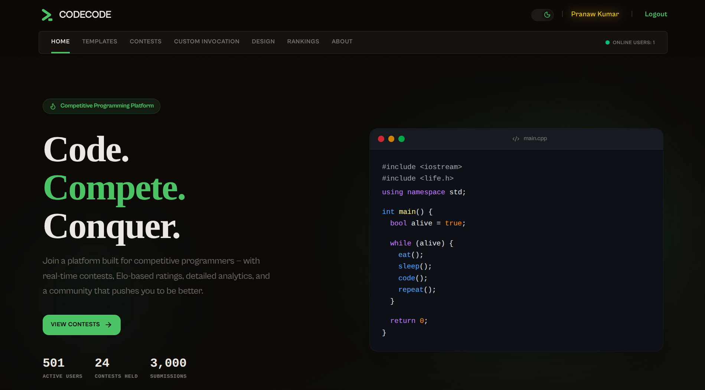
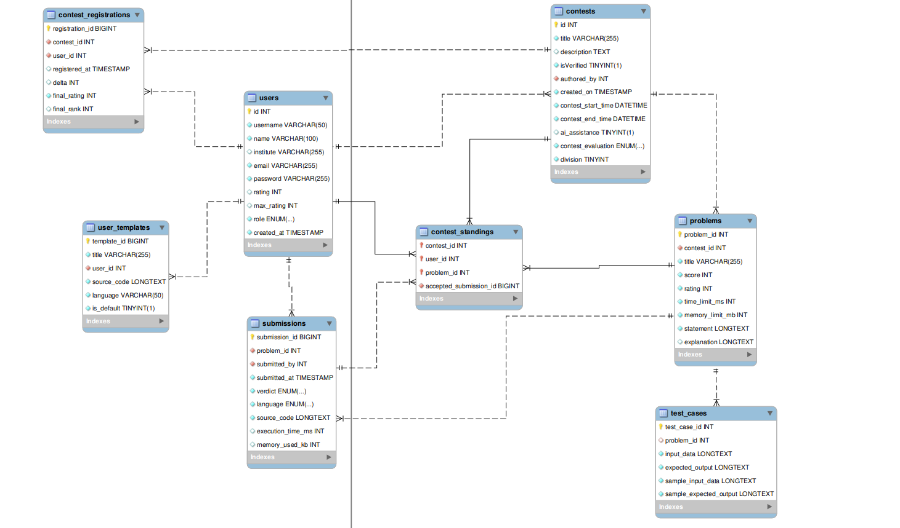
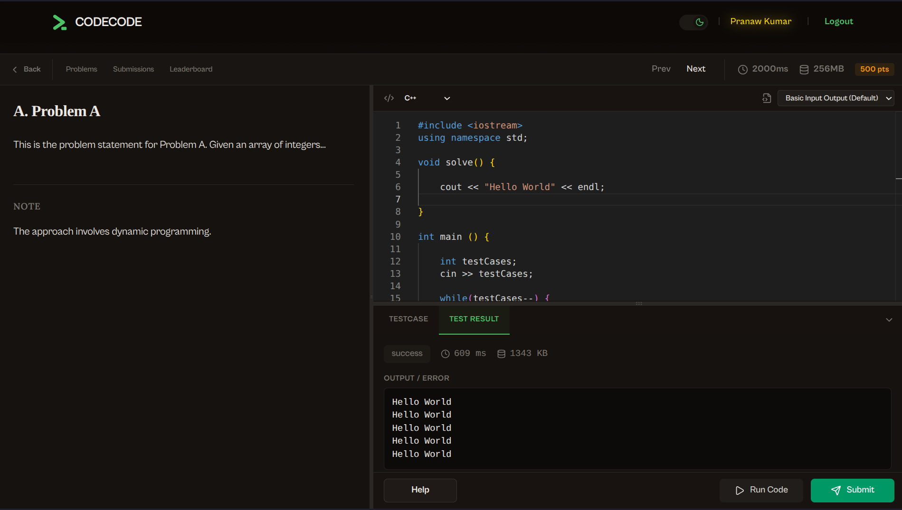
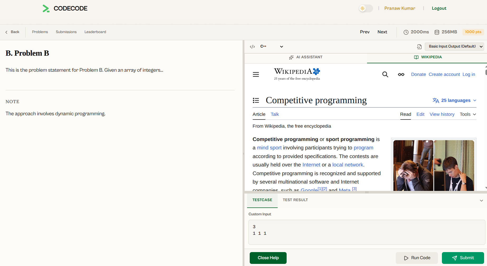
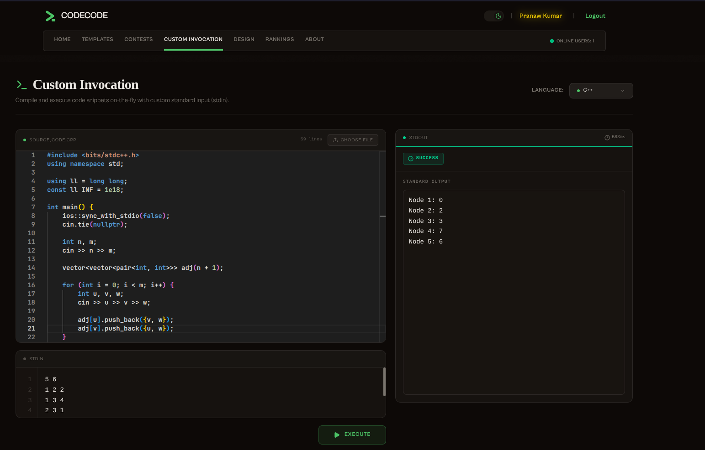
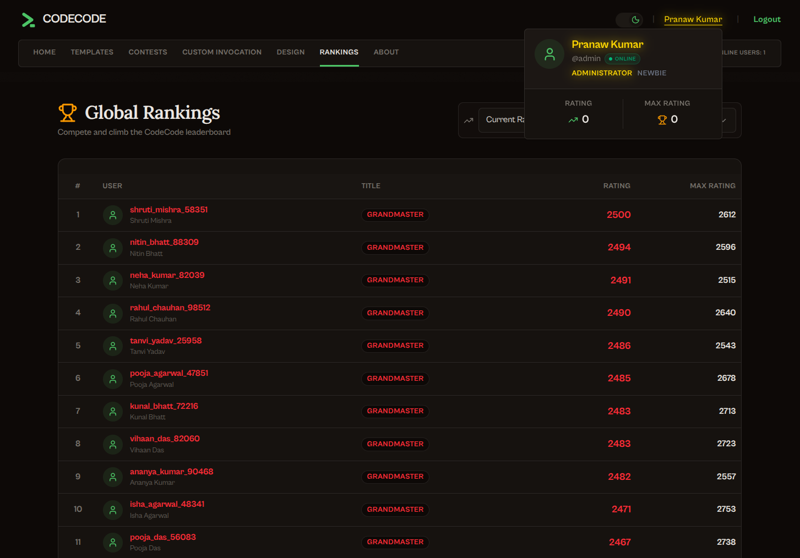
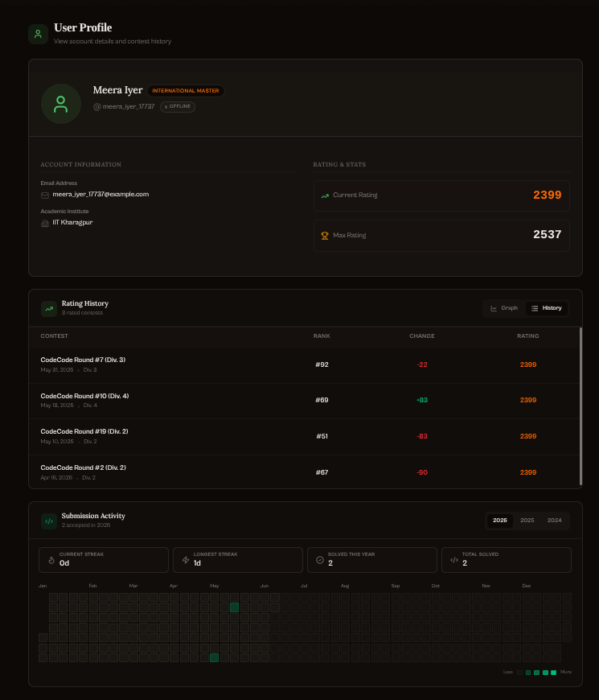

# CodeCode — Competitive Programming Platform


*A sleek, high-performance competitive programming platform built for algorithmic contests and continuous learning.*

[Watch Demo Video Here]()
*(Will be added soon!)*

---

## 📖 About The Project

**CodeCode** is a production-grade competitive programming and algorithmic practice platform. Built to handle heavy workloads, it features a completely asynchronous, sandboxed online judge capable of compiling and evaluating user code against strict time and memory constraints. 

Unlike traditional platforms that rely on slow HTTP polling, CodeCode utilizes a **Real-Time WebSocket Architecture** backed by Redis Pub/Sub, delivering submission verdicts to the user's browser the exact millisecond they finish executing. 

### Core Functionality
- **Contest Arena**: Users can create, verify, and participate in timed contests.
- **Online Judge**: Isolated, network-disabled Docker containers safely evaluate C, C++, Java, Python, and JavaScript code. Compilation and execution are decoupled to prevent memory limit bugs.
- **Anti-Cheat & Inbuilt IDE**: An integrated Monaco editor with strict anti-cheat measures. During live contests, copying the problem statement is disabled, and the editor tracks internal clipboard events to strictly block any external code pastes. Users can manage their own language templates, which are locked during active contests.
- **Elo Rating System**: Post-contest, the platform automatically recalculates participant ratings using a zero-sum, transaction-safe Elo algorithm.
- **AI Coding Assistant & Contest Design**: Powered by the Google Gemini API, users can ask an AI mentor for conceptual hints (strictly barred from generating actual code). For authors, the AI automatically refines problem statements and generates edge-case test cases during contest creation.
- **User Analytics**: Detailed profile pages featuring rating trajectory graphs and GitHub-style submission heatmaps.
- **Real-Time Tracking**: Websockets automatically track and broadcast the exact number of live online users on the platform.



*Database Schema Diagram*



*The Contest Arena featuring the built-in Monaco Editor and real-time Socket.io execution feedback.*



*Users can take help from an embedded Wikipedia during a contest, and get conceptual help from the AI assistant, such as understanding problem statements (if enabled by the contest creator).*



*Integrated code runner supporting custom inputs and instant compilation feedback.*


*Contest creation editor with automated problem statement refinement and testcase generation powered by AI.*



*Real-time contest standings and live leaderboard to track participant performance and submissions.*



*User profile featuring activity heatmaps and Elo rating graphs.*

---

## 🛠️ Tech Stack & Main Libraries

CodeCode is built as a highly decoupled Monorepo, split into a React Frontend and a Node.js Backend.

### Frontend (`/client`)
- **Framework**: React 19 + Vite + React Router DOM
- **UI/Styling**: Tailwind CSS + Radix UI (Headless components) + Lucide Icons + next-themes (Dark Mode)
- **Editor & Content**: `@monaco-editor/react` (Code IDE) and `@uiw/react-md-editor` (Markdown rendering)
- **Real-Time**: `socket.io-client`
- **Analytics**: `recharts` (SVG Charts)

### Backend (`/server`)
- **Runtime & Framework**: Node.js + Express.js v5
- **Database**: MySQL 8 (using `mysql2` driver with atomic transactions and complex JOINs)
- **Job Queue**: BullMQ + Redis (ioredis) for asynchronous code execution queues.
- **Real-Time**: Socket.IO + Redis Pub/Sub integration.
- **Execution Engine**: Docker (`child_process.execFile` interacting with `gcc`, `python`, `node`, `openjdk` images)
- **AI Integration**: Google Gemini API (Cloud LLM)
- **Security**: JWT (`httpOnly` cookies), `bcrypt`, `express-rate-limit`

---

## 🚀 Running Instructions

To run CodeCode locally, you will need **Node.js**, **MySQL**, **Redis**, and **Docker** installed on your system. Optionally, you will need **Ollama** installed if you wish to use the native AI coding assistant.

### 1. Database & Caching setup
- Start your **MySQL** server.
- Start your **Redis** server (default port `6379`).
- *(Optional)* Start **Ollama** and ensure the model (e.g. `gemma3:4b`) is pulled and running.

### 2. Backend Setup
Navigate to the `server/` directory:
```bash
cd server
```
- Install dependencies: `npm install`
- Copy the environment variables template: `cp .env.sample .env`
- **Crucial**: Open the `.env` file and fill in all variables, including your MySQL credentials (`MYSQL_PASSWORD`, `MYSQL_DB`), Redis ports, and JWT Secrets.
- Load the database schema:
  ```bash
  mysql -u root -p < src/db/schema.sql
  ```
- Start the server (runs both the API and the background judge workers in parallel):
  ```bash
  npm run dev
  ```

### 3. Frontend Setup
Navigate to the `client/` directory:
```bash
cd client
```
- Install dependencies: `npm install`
- Copy the environment variables template: `cp .env.sample .env`
- Ensure `VITE_API_BASE_URL` in `.env` is pointing to the backend (e.g., `http://localhost:8000/api/v1`).
- Start the frontend:
  ```bash
  npm run dev
  ```

The platform should now be accessible at `http://localhost:5173`.

---

## 🔮 Future Expected Features

The platform is continuously evolving. Planned features include:
- **Plagiarism Checker**: Implementing an ML pipeline to detect code similarity across submissions to maintain contest integrity.
- **Advanced Anti-Cheat**: Tracking keystroke stats (typing speed) and tab-switching monitoring to prevent users from cheating during live contests.

---

### Documentation References
For deep dives into the technical implementations:
- [Server Architecture & Data Flow](./server/docs/architecture.md)
- [Server API Reference (Swagger)](./server/docs/api.md)
- [Frontend README](./client/README.md)
- [Commit History & Design Rationale](./server/docs/notes.md)

---

**Made with ❤️ by Pranaw Kumar.**
